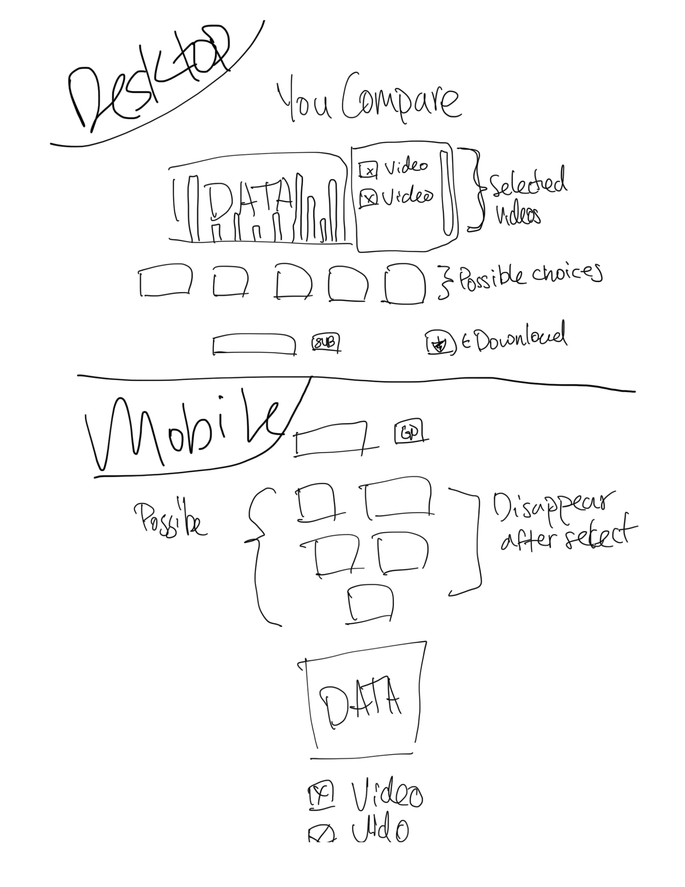

# YouCompare
A web application that selects and compares data points between two videos

### Getting Started
[Click Here]() to visit the deployed application

### Technologies Used
- HTML5/CSS3
- Google Fonts
- Javascript / jQuery
- Chart.js / Google Charts
- YouTube Data API

### Screenshots
###### Whiteboard Drawing

### TO-DO:
- search for a YouTube video
- select one of the predetermined metrics
- display chart comparing the two datasets

