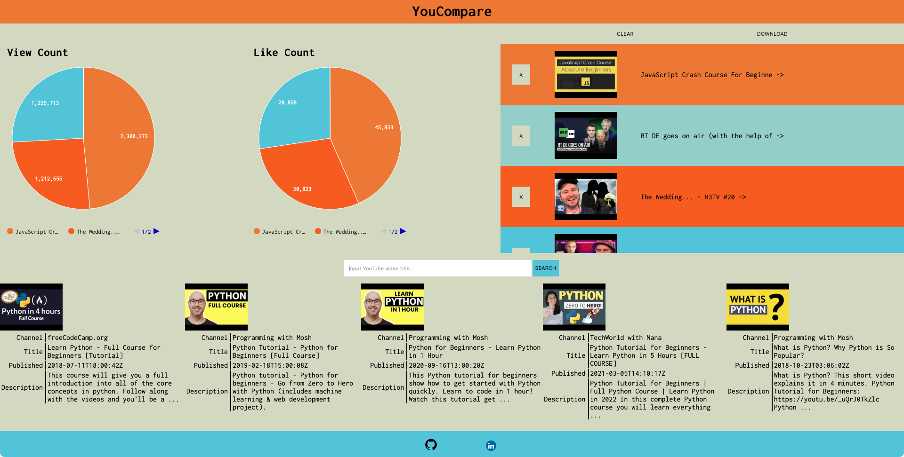

# YouCompare
A web application that selects and compares data points between two videos

### Getting Started
[Click Here](https://brave-meninsky-79a382.netlify.app/) to visit the deployed application

### Technologies Used
- HTML5 / CSS3
- [Google Fonts](https://fonts.google.com/specimen/Ubuntu)
- Javascript / [jQuery](https://jquery.com/)
- [Google Charts](https://developers.google.com/chart)
- [YouTube Data API](https://developers.google.com/youtube/v3)

### Screenshots
###### Whiteboard Drawing

###### Deployed Application

### TO-DO:
- add API switching functionality
- style for mobile
- add clear button to clear all items
- add download button for statistics